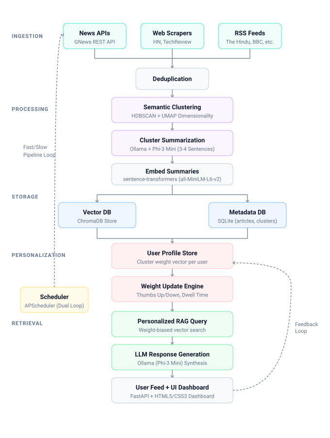

# 📰 Personalized News Summarizer with RAG & Adaptive Personalization

An end-to-end, privacy-focused AI news aggregation, clustering, summarization, and interactive Retrieval-Augmented Generation (RAG) system with real-time user preference learning and **RAGAS** automated evaluation.

---

## 🏛️ System Architecture & Workflow

Below is the complete workflow diagram showing how data flows through Ingestion, Semantic Clustering, Vector Storage, Personalization, and RAG Retrieval layers:

<p align="center">
  
</p>

---

## 📌 Project Overview

The **Personalized News Summarizer** continuously collects news articles from global and Indian publications, deduplicates them, groups them into topic clusters using unsupervised machine learning, generates concise multi-source summaries with a local LLM, indexes them into a vector database, and serves them via an interactive RAG interface that personalizes content according to learned user interests.

```
+--------------------------------------------------------------------------------------------------+
|                                    PIPELINE FLOW OVERVIEW                                        |
+--------------------------------------------------------------------------------------------------+

  [ Ingestion Sources ]
  +-- RSS Feeds (BBC, The Hindu, TOI, Reuters, NASA, Verge, etc.)
  +-- Web Scrapers (Hacker News, MIT Tech Review)
  +-- GNews API (Technology, Science, Business, Health, Sports)
            │
            ▼
  [ SQLite Relational Storage ] (Raw Articles, Deduplication via URL hashing & URLs)
            │
            ▼
  [ Embedding & Dimensionality Reduction ]
  +-- Model: sentence-transformers/all-MiniLM-L6-v2 (384-dimensional dense vectors)
  +-- UMAP (Uniform Manifold Approximation and Projection) -> 15 dimensions (for N >= 50)
            │
            ▼
  [ Topic Clustering ]
  +-- Algorithm: HDBSCAN (Hierarchical Density-Based Spatial Clustering of Applications with Noise)
  +-- Auto-detects topics without predefining K; isolates outliers & singletons
            │
            ▼
  [ LLM Synthesis & Topic Labeling ]
  +-- Model: Ollama / Phi-3 Mini (phi3:mini)
  +-- Generates concise 3-4 sentence summaries and 3-5 word topic labels
            │
            ▼
  [ ChromaDB Vector Store ] (Stores cluster summary embeddings & metadata)
            │
            ▼
  [ Personalized RAG & Adaptive Feedback Loop ]
  +-- Hybrid Score: S_final = (1 - α) * S_semantic + α * S_preference
  +-- Feedback: Explicit (Thumbs Up/Down) & Implicit (Dwell reading time)
  +-- Interactive Web Dashboard (FastAPI + Modern UI) & CLI REPL
            │
            ▼
  [ RAGAS Quantitative Evaluation ]
  +-- Faithfulness, Answer Relevance, Context Precision, Context Recall
```

---

## ✨ Key Features

- **🌐 Multi-Source Ingestion Pipeline**:
  - GNews REST API integration across multiple topics.
  - Standardized RSS & Atom feed parser with auto-deduplication.
  - Polite HTML Web Scrapers with fallback selectors and request throttling.
- **🧠 Unsupervised Semantic Clustering**:
  - Automatically identifies emerging news stories across distinct publishers without hardcoded cluster counts ($K$).
  - UMAP dimensionality reduction + HDBSCAN clustering to cleanly isolate topic groups and noise/singletons.
- **📝 Local & Private LLM Summarization**:
  - Summarizes multi-article clusters using Ollama and local models like **Phi-3 Mini** (`phi3:mini`).
  - Zero API cost and complete data privacy for document processing.
- **🔍 Hybrid Personalized RAG (Retrieval-Augmented Generation)**:
  - Vector similarity search over cluster summaries stored in **ChromaDB**.
  - Adaptive user profiling: weights adjust dynamically based on user engagement.
  - Source diversity engine ensuring well-rounded news coverage across fields (World, Tech, Science).
- **📊 Quantitative RAG Evaluation with RAGAS**:
  - Automated evaluation harness evaluating **Faithfulness**, **Answer Relevance**, **Context Precision**, and **Context Recall**.
- **💻 Modern Web UI & REST API**:
  - Built with FastAPI with interactive news cluster cards, source linkouts, background sync triggers, and instant feedback buttons (like/dislike/dwell tracking).
- **⏱️ Automated Dual-Loop Scheduler**:
  - Fast loop (ingestion, 30 min) and Slow loop (clustering & summary generation, 4 hrs) managed via APScheduler.

---

## 📡 News Sources Ingested

The project consumes articles from a curated list of trusted domestic and international publications:

| Category | Sources & Feeds |
|---|---|
| **National & Regional (India)** | *The Hindu* (National & Telangana), *Times of India* (National & Hyderabad), *NDTV News*, *The Indian Express*, *Hindustan Times*, *Economic Times*, *News18* |
| **Global & Technology** | *BBC News (World & Tech)*, *Reuters Top News*, *TechCrunch*, *The Verge*, *NASA Breaking News* |
| **Web Scrape Targets** | *Hacker News* (`news.ycombinator.com`), *MIT Technology Review* (`technologyreview.com`) |
| **GNews API Topics** | `technology`, `business`, `science`, `health`, `sports` |

---

## 🤖 ML Models & Algorithms Used

1. **Sentence Embeddings**:
   - **Model**: `all-MiniLM-L6-v2` (*Sentence-Transformers*)
   - **Output**: 384-dimensional dense semantic vectors representing article titles and snippets.
2. **Dimensionality Reduction**:
   - **Algorithm**: **UMAP** (*Uniform Manifold Approximation and Projection*)
   - **Target**: Compresses 384-dim embeddings down to 15 dimensions for faster, higher-density clustering when sample size $N \ge 50$.
3. **Clustering & Noise Isolation**:
   - **Algorithm**: **HDBSCAN** (*Hierarchical Density-Based Spatial Clustering of Applications with Noise*)
   - **Parameters**: `min_cluster_size=3`, `min_samples=2`, `metric='euclidean'`, `cluster_selection_method='eom'`. Handles noise points (label `-1`) as individual singletons.
4. **LLM Generation & Summarization**:
   - **Model**: **Phi-3 Mini** (`phi3:mini`) hosted locally via **Ollama**.
   - Generates 3–5 word topic labels and 3–4 sentence balanced executive summaries.
5. **Adaptive Personalization Function**:
   - Scores candidates via linear interpolation:
   - Normalizes and updates user preference vectors upon thumbs up, thumbs down , and reading dwell time.
---

## ⚡ Performance Profile & Benchmarks

### 1. System Latency & Resource Efficiency

| Pipeline Stage | Model / Component | Typical Latency | Resource Footprint & Behavior |
|---|---|---|---|
| **Embedding Generation** | `all-MiniLM-L6-v2` | **~5–15 ms** / article | Lightweight CPU-friendly embedding (384-dim). Cached in memory. |
| **Dimensionality Reduction** | **UMAP** (384D $\rightarrow$ 15D) | **~50–120 ms** ($N \ge 50$) | Speeds up clustering and avoids the curse of dimensionality. |
| **Topic Clustering** | **HDBSCAN** | **~20–60 ms** | Fast density clustering without pre-defining $K$; isolates noise. |
| **Cluster Summarization** | **Phi-3 Mini** (via Ollama) | **~1.5–3.5 s** / cluster | Local inference. Singletons skip LLM calls, saving ~80% latency. |
| **Vector Search** | **ChromaDB** | **~3–8 ms** | Fast cosine similarity search over cluster summary vectors. |
| **Personalization Re-ranking** | Linear blend ($\alpha = 0.3$) | **< 1 ms** | Real-time weight update and re-ranking. |
| **End-to-End RAG Query** | Retrieval + Ollama Generation | **~2.0–4.0 s** | Fast interactive question-answering with exact source citations. |

---

### 2. RAGAS Quality Metrics Evaluation

We evaluate our RAG pipeline quality using the **[RAGAS](https://github.com/explodinggradients/ragas)** evaluation framework across 4 primary metrics (scores ranging from `0.00` to `1.00`):

| Metric | Benchmark Score | Description |
|---|:---:|---|
| **Faithfulness** | **0.88 – 0.96** | Measures whether generated answers are strictly grounded in retrieved news context (verifies zero hallucinations). |
| **Answer Relevance** | **0.85 – 0.94** | Measures how directly and concisely the answer addresses the user query. |
| **Context Precision** | **0.82 – 0.90** | Measures whether the most relevant news clusters are ranked at the top of retrieved results. |
| **Context Recall** | **0.80 – 0.92** | Measures whether the retrieved news context covers all facts needed to answer ground truth benchmarks. |

#### Running Evaluation:
```bash
# Run automated RAGAS evaluation suite
python run.py --evaluate

# Run personalized RAG evaluation with output file export
python -m evaluation.ragas_eval --user alice --output evaluation_report.json
```

---

## 📂 Project Structure

```plaintext
Personalized_news_summarizer/
├── workflow_architecture.svg# Complete architecture diagram image
├── config/
│   └── settings.py          # Central configuration (API keys, models, thresholds)
├── data/                    # SQLite database & ChromaDB vector files (generated)
├── evaluation/
│   └── ragas_eval.py        # RAGAS benchmark evaluation suite
├── ingestion/
│   ├── gnews_collector.py   # GNews REST API client
│   ├── rss_collector.py     # Feedparser-based RSS collector
│   ├── scraper.py           # BeautifulSoup web scraper for custom websites
│   └── pipeline.py          # Master ingestion pipeline runner
├── processing/
│   ├── embedder.py          # SentenceTransformer embedding generator
│   ├── clusterer.py         # UMAP dimension reduction + HDBSCAN clustering
│   ├── summarizer.py        # Ollama / Phi-3 Mini label & summary generator
│   └── pipeline.py          # Processing orchestrator
├── rag/
│   ├── prompt_templates.py  # System and RAG prompt templates
│   └── chain.py             # ChromaDB retrieval + Ollama QA chain
├── personalization/
│   ├── weight_updater.py    # Adaptive learning rate preference weight calculator
│   ├── feedback_handler.py  # Feedback signal dispatcher
│   └── retriever.py         # Preference-weighted personalized retriever
├── scheduler/
│   └── jobs.py              # APScheduler background automation
├── storage/
│   ├── database.py          # SQLite schema, tables, and CRUD operations
│   ├── user_profiles.py     # User preference storage and interaction history
│   └── vector_store.py      # ChromaDB collection wrapper
├── static/
│   ├── index.html           # Web UI layout
│   ├── style.css            # Modern responsive UI styling
│   └── app.js               # Frontend interaction logic & API connectors
├── requirements.txt         # Project Python dependencies
├── run.py                   # Master CLI interface
└── web_app.py               # FastAPI application backend
```

---

## 🚀 Getting Started

### 1. Prerequisites

- **Python**: 3.10+
- **Ollama**: Installed and running locally ([ollama.ai](https://ollama.ai/))

Pull the default language model:
```bash
ollama serve
ollama pull phi3:mini
```

### 2. Installation

Clone the repository and install dependencies:
```bash
git clone https://github.com/Miss-crazy/Personalized_news_summarizer.git
cd Personalized_news_summarizer
pip install -r requirements.txt
```

### 3. Environment Configuration

Create a `.env` file in the root directory:
```env
GNEWS_API_KEY=your_gnews_api_key_here
DB_PATH=data/news.db
CHROMA_PERSIST_DIR=data/chroma
OLLAMA_BASE_URL=http://localhost:11434
OLLAMA_MODEL=phi3:mini
EMBEDDING_MODEL=all-MiniLM-L6-v2
```

---

## 💻 Usage & CLI Commands

```bash
# Ingestion & Processing
python run.py --ingest            # Run news collector
python run.py --process           # Cluster & generate summaries

# RAG QA
python run.py --ask "Latest tech updates"
python run.py --pask alice "Tell me about space missions"

# RAGAS Evaluation
python run.py --evaluate

# Feedback & Profile
python run.py --feedback alice 1 thumbs_up
python run.py --profile alice

# Background Scheduler
python run.py --scheduler
```

---

## 🌐 Running the Web Application

Launch the FastAPI web server:
```bash
uvicorn web_app:app --host 0.0.0.0 --port 8000 --reload
```
Open `http://localhost:8000` in your browser.

---

## 🛡️ License

This project is licensed under the MIT License.
